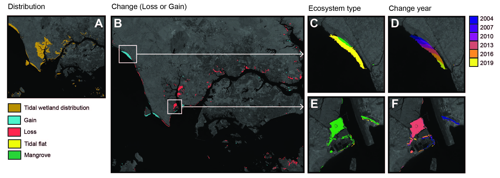

# Supplementary Data S1 to Losses and gains of Earth's tidal wetlands

#### Description:

[Google Earth Engine](https://earthengine.google.com) code for analysing global change of tidal wetlands. This project maps change of tidal wetlands (collectively referring to tidal flats, tidal marshes and mangroves). The data enable a synoptic view of change of three highly connected coastal ecosystems.

This repository contains the source software developed for the project. A full description of the methods, validation, and limitations of the data produced by this software is available in the published paper. For project updates and additional frequently asked questions, please refer to the [project website](https://www.globalintertidalchange.org/). 

#### Citation
Use of any aspect of this study requires full attribution (see licence). Please cite the published paper:
Murray et al. (in submission) Losses and gains of Earth's tidal wetlands.

#### Usage
The code developed to map tidal wetlands globally in Earth Engine is designed to be deployed in Earth Engine in the following major stages:
* Develop covariate layers from Landsat Archive Imagery
* Sample covariate layers using a training library annotated by ecosystem type
* Train a Random Forest model for predicting the distribution of tidal wetlands (Stage 1)
* Identify change flag areas between t1 and t7 
* Classify the change flat into loss, gain or stable (Stage 2)
* Identify the type of ecosystem lost or gained over the study period (Stage 3)

**Note:** Owing to limited [usage and asset quotas](https://developers.google.com/earth-engine/guides/usage?hl=en) of users of Earth Engine, this code is unlikely to run at the full global scale in the Earth Engine [code editor](https://code.earthengine.google.com/). Please contact the corresponding author of the published paper to discuss how to implement this code in Earth Engine.

#### Data
Datasets associated with this project are archived at the following locations.

#### Licence
This software is licensed under a Creative Commons Attribution 4.0 International License. [CC BY 4.0](https://creativecommons.org/licenses/by/4.0/)

#### Further information:
For any further information about this project, code or data please contact the corresponding author of the published paper.
