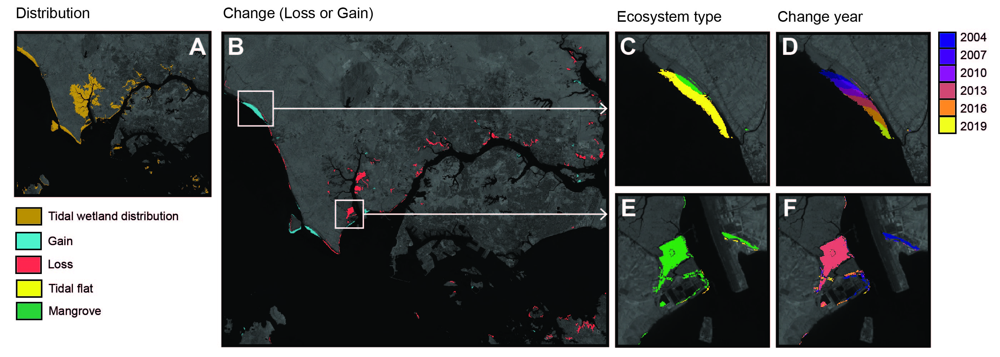

# Code for:
### High-resolution mapping of losses and gains of Earth's tidal wetlands (2022)

#### Description:

[Google Earth Engine](https://earthengine.google.com) code for analysing global change of tidal wetlands. This project maps change of tidal wetlands (collectively referring to tidal flats, tidal marshes and mangroves). The data aim to provide a synoptic view of change of three of the world's highly coupled coastal ecosystems.

This repository contains the source software developed for the project. A full description of the methods, validation, and limitations of the data produced by this software is available in the published paper. For project updates and additional frequently asked questions, please refer to the [project website](https://www.globalintertidalchange.org/). 

#### Citation
Use of any aspect of this study requires full attribution (see licence). Please cite both this archive and the published paper:

Murray, N.J., Worthington, T.A., Bunting, P., Duce, S., Hagger, V., Lovelock, C.E., Lucas, R., Saunders, M.I., Sheaves, M., Spalding, M., Waltham, N.J., Lyons, M.B., (2022) High-resolution mapping of losses and gains of Earth's tidal wetlands. *Science*. [paper link](https://doi.org/10.1126/science.abm9583)

#### Usage
The code developed to map tidal wetlands globally in Earth Engine is designed to be deployed separately in Earth Engine in following order:
1. Develop covariate layers from Landsat Archive Imagery `javascript/covariate_reduce.js`
2. Sample covariate layers using a training library annotated by ecosystem type `javascript/covariate_sample.js`
3. Random Forest model for predicting the distribution of tidal wetlands (Stage 1) `javascript/tidal_wetland_extent.js`
4. Tidal wetland extent post-processing `javascript/extent_post_processor_mmu.js`
5. Identify change flag areas between t1 and t7 `javascript/change_flag.js` 
6. Post process change `javascript/change_post_processor.js`
7. Classify the change flat into loss, gain or stable (Stage 2) `javascript/tidal_wetland_change_classifier.js`
8. Identify the type of ecosystem lost or gained over the study period (Stage 3) `javascript/tidal_wetland_type.js`

The result is an image with six bands: loss, lossYear, lossType, gain, gainYear, gainType.

#### User notes 
* Owing to limited [usage and asset quotas](https://developers.google.com/earth-engine/guides/usage?hl=en) of users of Earth Engine, aspects of this software are unlikely to run at the full global scale in the Earth Engine [code editor](https://code.earthengine.google.com/). 
* This code has been simplified to remove versioning, data properties, file paths and handling of usage quotas. 
* Please contact the corresponding author of the published paper to discuss how to best implement this code in Earth Engine.

#### Data
Datasets associated with this project are archived at the following locations.

#### Licence
This software is licensed under a Creative Commons Attribution 4.0 International License. [CC-BY-4.0](https://creativecommons.org/licenses/by/4.0/)

#### Further information:
For any further information about this software please contact nicholas.murray@jcu.edu.au.

#### Tests
- `javascript/covariate_reduce.js` ok
- `javascript/covariate_sample.js` ok
- `javascript/tidal_wetland_extent.js` ok
- `javascript/extent_post_processor_mmu.js` ok
- `javascript/change_flag.js` - ok
- `javascript/change_post_processor.js` - ok
- `javascript/tidal_wetland_change_classifier.js` - ok
- `javascript/tidal_wetland_type.js` - ok
